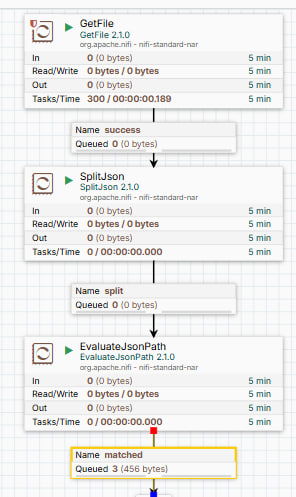

# Приведение JSON формата к линейной структуре   
## 1. Запуск контейнера

```
docker run --name nifi \
  -p 8443:8443 \
  -v ~/etl_proc/hw_2:/opt/nifi/nifi-current/data \
  -d \
  -e SINGLE_USER_CREDENTIALS_USERNAME=admin \
  -e SINGLE_USER_CREDENTIALS_PASSWORD=ctsBtRBKHRAx69EqUghvvgEvjnaLjFEB \
  apache/nifi:latest
```
## 2. Работа с NIFI
UI: https://localhost:8443

### Процессор 1. Получение файла на обработку (в данном случае json-формата)
### Процессор 2. Деление json. 
```
JsonPath Expression=$['pets']
```
### Процессор 3. Извлечение данных из json 

## 3. Схема процессоров 
 
## Файлы
* Исходный файл ``` pets-data.json ```
* Распарсенные файлы в папке ``` parse_json ``` :  ``` pets-data1.json ``` , ``` pets-data2.json ``` , ``` pets-data3.json ```


